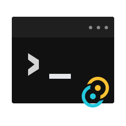
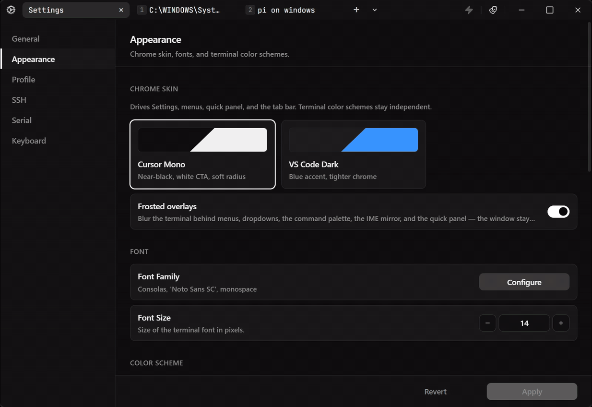

<p align="center">
  
</p>

<h1 align="center">TTerm</h1>

<p align="center">
  <strong>AI Agent 时代，为 Windows 开发工作重新设计的轻量、快速反应任务终端。</strong><br/>
  承载本地、远程和设备上的工作流，而不仅仅是工具。<br/>
  快速切入本地、SSH、串口任意会话。针对中文输入优化和 Agent TUI 能一起用。冷启动不到一秒。
</p>

<p align="center">
  <a href="https://github.com/rede97/tterm/releases/latest"><strong>Download for Windows</strong></a>
  ·
  <a href="README_EN.md">English</a>
</p>

<p align="center">
  <a href="https://github.com/rede97/tterm/actions/workflows/ci.yml"></a>
  <a href="https://github.com/rede97/tterm/releases/latest"></a>
  <a href="https://github.com/rede97/tterm/blob/main/LICENSE"></a>
</p>

<p align="center">
  
</p>
<p align="center">
  <b>多会话 + 远程端口</b><br/>
  场景：本机和多台 SSH 在同一个窗口里切。<br/>
  操作：<code>Ctrl+P</code> 跳到已有会话 → <code>Ctrl+Shift+P</code> 再开一台 SSH → Quick Panel 给这条会话加 Remote 转发。
</p>

<p align="center">
  
</p>
<p align="center">
  <b>Agent TUI + 中文输入</b><br/>
  场景：本机 Agent 全屏 TUI，要打中文、图标也不能糊。<br/>
  操作：字体选择器把系统 Nerd Font 置顶并 Apply → <code>Ctrl+P</code> 切到 Agent → 拼音后空格上屏。
</p>

<p align="center">
  
</p>
<p align="center">
  <b>串口现场 + Share with AI</b><br/>
  场景：设备挂在串口上，本机 Agent 要看见并操作，设备不用装 Agent。<br/>
  操作：打开串口 → Quick Panel 把 Profile 换成 AT → 打开 Share → 会话里出现设备回显。
</p>

## 为什么是 TTerm

### 约 5.8 MB：轻，而且快

冷启动不到 1 秒。安装包仅约 5.8 MB。

### 开箱即用，不仅是工具

内嵌主题、等宽字体。内建 SSH 客户端，已有 `~/.ssh/config` 装完就能连，不必再配一套工具链。为 Vibe Coding 和 Agent 工作流而生，而不是再做一个功能更多的传统终端。

### 纯键盘操控，VS Code 兼容

操控兼容 VS Code 习惯（`Ctrl+Shift+P` / `Ctrl+P` / `Ctrl+Tab`），纯键盘日常不必碰鼠标。

### Local、SSH、Serial 全套工作流

本地 Shell、SSH、Serial 串口都是一等标签，为每种场景做了专门优化。

* SSH：配置编辑、密钥上传、本地 / 远程 / 动态端口转发
* Serial：运行中改波特率；Profile 按场景切换输入和换行（Linux/Console、AT 命令、Log）

### 让 AI 看见真实现场

**Share with AI** 把正在运行的会话交给本机 Agent：字符级屏幕（滚动区、颜色、光标、TUI），不是截图或 OCR。授权后 Agent 可以回写按键。Agent 跑在本机，远程主机和设备不用装任何东西。服务只听 `127.0.0.1`。协议见[会话分享](docs/ai-session-sharing.md)。

### 中文输入（IME）优化

TTerm 在输入点附近重建组合显示，中文（以及日文、韩文）可以在隐藏光标的 TUI 里稳定打字。Windows 下输入法组合串和 TUI 天然不适配，跟着抖动跑偏，是多年来中文 Windows 用户的痛点。

## 功能

- **本地** — 读取 Windows Terminal Profile；从指定目录开 Shell；资源管理器 **Open in TTerm**
- **SSH** — 密码和口令在标签里输入；主机指纹对话框
- **串口** — 自动发现设备（USB VID/PID）；直发 / 回显 / 整行；流控与 RTS/CTS/DTR/DSR
- **会话恢复** — 休眠或短暂传输中断后重连，保留历史
- **低占用** — Tauri + xterm.js；终端字节走本机 WebSocket，不经过 IPC

## 适合谁

### Unix 习惯用户

不仅面向中文用户。Windows 一直缺少一款稳定可靠、深度适配 Unix CLI/TUI 和 SSH 工作流的终端；在 AI Agent 时代尤其明显，也是 Windows 相对 macOS、Linux 等 Unix 系统拉开差距的地方。

### 远程运维、嵌入式工程师

把 **Share with AI** 接到正在跑的 SSH 或串口上，辅助远程排障和现场调试。无需在远程主机上安装 AI Agent。

- 以 `Claude Code`、`Codex`、`Pi`、`Kimi Code`、`Hermes` 为日常主工具的开发者
- 习惯 VS Code 快捷键、希望终端也能纯键盘操作
- 用中文（以及日文、韩文）和 Agent 交流，被 Windows IME / TUI 打断过
- 在意启动速度、内存和数据不出本机

## 下载

从 [Releases](https://github.com/rede97/tterm/releases/latest) 下载 Windows 安装包（NSIS / MSI）。

## 从源码构建

```sh
bun install
bun run tauri build
```

技术栈：Tauri v2（Rust）+ xterm.js。开发与测试见 [docs/testing.md](docs/testing.md)。

## 许可

[MIT](LICENSE)
