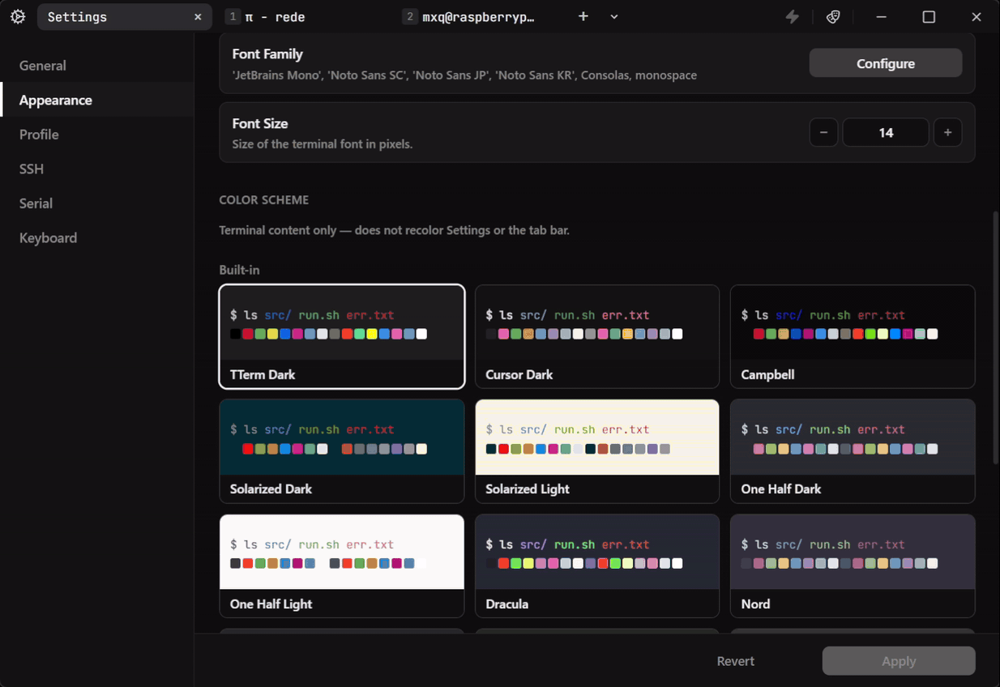
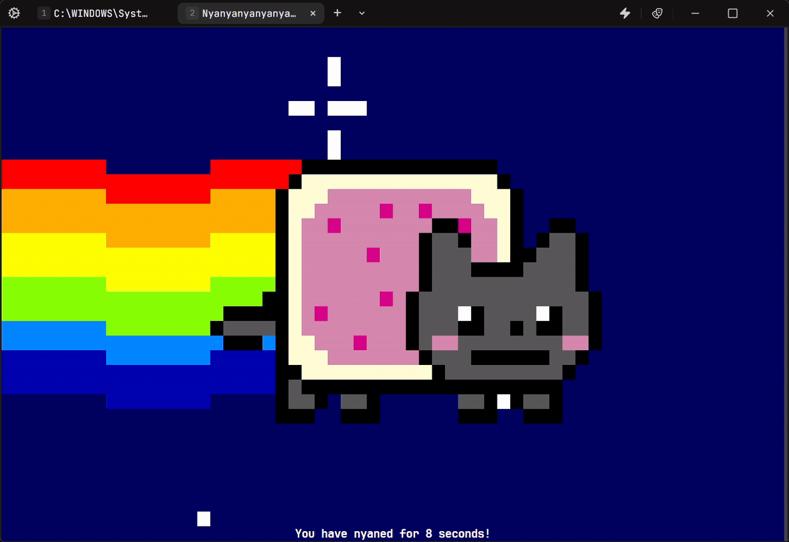
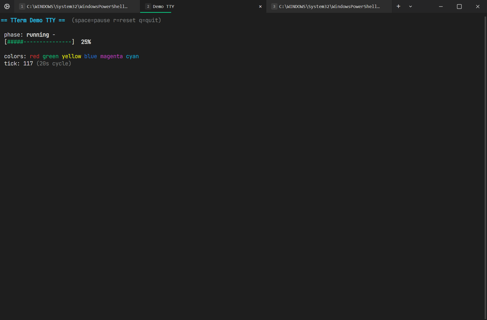
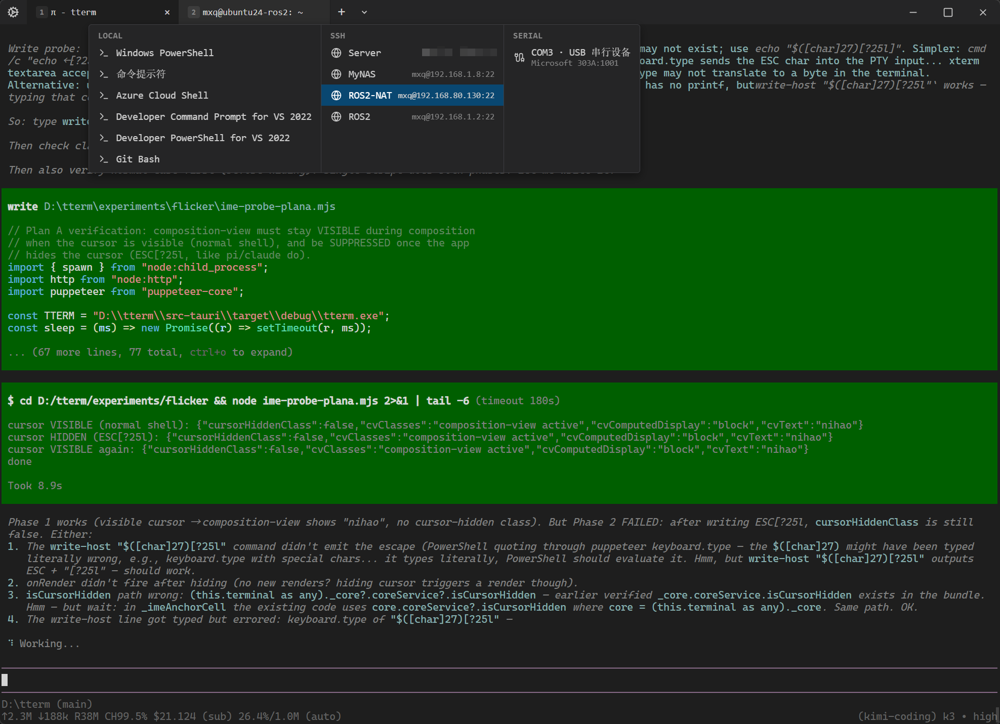
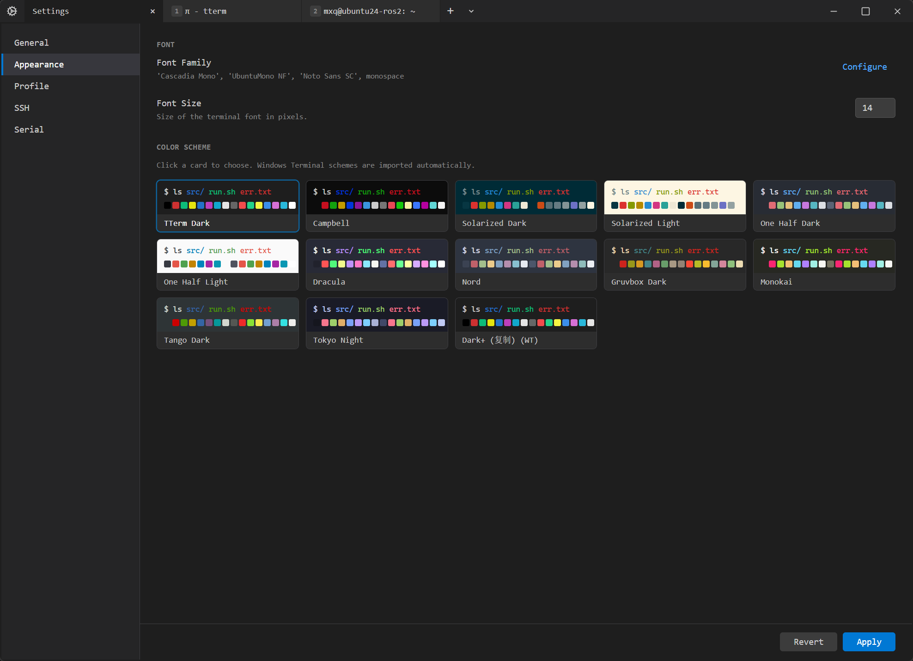
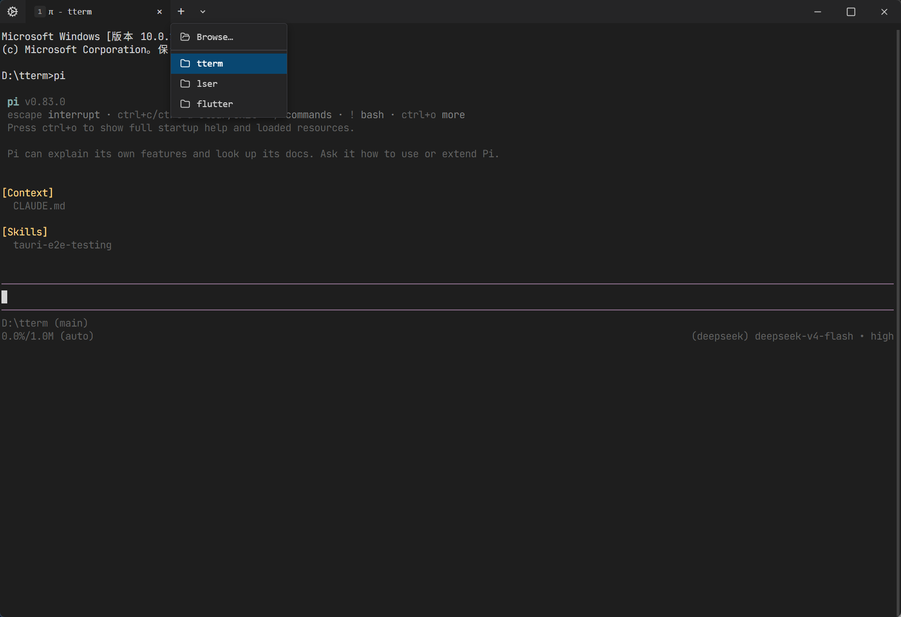

<p align="center">
  
</p>

<h1 align="center">TTerm</h1>

<p align="center">
  <strong>A lightweight, fast Windows task terminal redesigned for development work in the AI agent era.</strong><br/>
  It carries local, remote, and device workflows—not merely a tool.<br/>
  Jump into any local, SSH, or serial session. Chinese input and agent TUIs work together. Cold start under a second.
</p>

<p align="center">
  <a href="https://github.com/rede97/tterm/releases/latest"><strong>Download for Windows</strong></a>
  ·
  <a href="README.md">中文</a>
</p>

<p align="center">
  <a href="https://github.com/rede97/tterm/actions/workflows/ci.yml"></a>
  <a href="https://github.com/rede97/tterm/releases/latest"></a>
  <a href="https://github.com/rede97/tterm/blob/main/LICENSE"></a>
</p>

<!-- Demo clips: drop GIFs at these paths, then uncomment.
     docs/images/hero.gif      cold start + palette + new session
     docs/images/share.gif     Share with AI
     docs/images/sessions.gif  local / SSH / serial
<p align="center">
  
</p>
<p align="center">
  
  &nbsp;
  
</p>
-->

<p align="center"><em>Demo GIFs coming. Screenshots below are placeholders until those clips land.</em></p>

| Terminal and agent | Local, SSH, and serial |
| :---: | :---: |
|  |  |
| Themes and fonts | Start from a project directory |
|  |  |

## Why TTerm

### Under 10 MB: light, and fast

Cold start under 1 second. Installer only about 7 MB.

### Ready out of the box, not merely a tool

Bundled themes and monospace fonts. Built-in SSH client: existing `~/.ssh/config` hosts connect after install, with no extra toolchain. Built for vibe coding and agent workflows—not another traditional terminal with a longer feature list.

### Keyboard-first, VS Code-compatible

Defaults follow VS Code habits (`Ctrl+Shift+P` / `Ctrl+P` / `Ctrl+Tab`). Daily work does not need the mouse.

### Local, SSH, and serial as one workflow

Local shells, SSH, and serial are first-class tabs, each tuned for its scene.

* SSH: config editing, public-key upload, local / remote / dynamic port forwarding
* Serial: live baud changes; profiles switch input and newlines per scene (Linux/Console, AT commands, Log)

### Let AI see the live session

**Share with AI** hands a running session to a local agent as character-level screen state (scroll regions, color, cursor, TUIs)—not a screenshot or OCR. With permission, the agent can type back. The agent runs on your machine; the remote host and device need nothing installed. The share server listens only on `127.0.0.1`. Protocol: [session sharing](docs/ai-session-sharing.md).

### Chinese input (IME)

TTerm rebuilds composition next to the input cell so Chinese (and Japanese / Korean) typing stays stable inside hidden-cursor TUIs. Windows IMEs and TUIs do not fit together natively; composition text jumping around has been a long-standing pain for Chinese Windows users.

## Features

- **Local** — Windows Terminal profiles; shells from a chosen directory; Explorer **Open in TTerm**
- **SSH** — passwords and passphrases typed in the tab; host-key dialog
- **Serial** — auto-discovery (USB VID/PID); direct / echo / line input; flow control and RTS/CTS/DTR/DSR
- **Session recovery** — silent reattach after sleep or a short transport drop
- **Low overhead** — Tauri + xterm.js; terminal bytes stay on a local WebSocket, not IPC

## Who it is for

### People with Unix habits

Not only for Chinese users. Windows has long lacked a solid terminal that is deeply adapted to Unix CLI/TUI and SSH workflows. That gap is sharper in the AI agent era, and it is one place Windows still trails macOS, Linux, and other Unix systems.

### Ops and embedded engineers

**Share with AI** on a live SSH or serial session helps remote debug and on-device diagnosis. No AI agent needs to be installed on the remote host.

- Developers who live in `Claude Code`, `Codex`, `Pi`, `Kimi Code`, or `Hermes`
- VS Code keyboard habits, and a terminal that does not need the mouse
- Anyone who talks to agents in Chinese (or Japanese / Korean) and has hit Windows IME / TUI bugs
- Anyone who cares about startup time, memory, and keeping data on-box

## Download

Get the Windows installer (NSIS / MSI) from [Releases](https://github.com/rede97/tterm/releases/latest).

## Build from source

```sh
bun install
bun run tauri build
```

Stack: Tauri v2 (Rust) + xterm.js. Development and tests: [docs/testing.md](docs/testing.md).

## License

[MIT](LICENSE)
